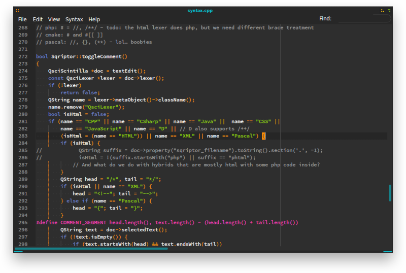

# Sqriptor 
#### QScintilla based text editor

> "Every man should plant a tree, have a son and write a TextEditor"<br>
> &emsp;&emsp;&emsp;&emsp;&emsp;&emsp;&emsp;&emsp;&emsp;&emsp;&emsp;&emsp;&emsp;&emsp;&emsp;&emsp;&emsp;&emsp;&emsp;&emsp;&emsp;&emsp;&emsp;&emsp;  --- Proverb

> "The best TextEditor I've ever used!"<br>
> &emsp;&emsp;&emsp;&emsp; --- Undisclosed user, 2021

> "Testimonials are useless, just try whether you like it."<br>
> &emsp;&emsp;&emsp;&emsp;&emsp;&emsp;&emsp;&emsp;&emsp;&emsp;&emsp;&emsp;&emsp;&emsp;&emsp;&emsp; --- Common sense


#### Obligatory screenshot:
(spoiler, it's mostly text… nicely blurred by github)


## NAQ
##### Never Asked Questions
* Q: What about _random webengine/blink/electron based editor_?
  * A: I'm not using a WebBrowser as a TextEditor. Are you nuts? Also performance, frankly.
* Q: What about Scite, it's scintilla - do you hate gtk?
  * A: Somewhat. But more importantly scite exposes all scintilla configurations directly to the user. The html lexer alone has a trillion… ok, that's exaggerated: half a trillion syntax items. It's very configurable. Through text files. It's not configurable at all.
* Q: What about vim?
  * A: I like vim. It's a great text editor. And in the hands of average humans an even better entropy generator.
* Q: KWrite/Kate?
  * A: Very good editor. And half a Desktop Environment on its tail :(
* Q: There're _feature rich IDEs and EMacs_ …
  * A: Yes. And here is a text editor. Your point being?
* Q: If it can't read from stdin, it's not real POSIX! Can sqriptor read from stdin?
  * A: Yes :)
* Q: Your TextEditor sucks! Sqriptor sucks!
  * A: Your opinion sucks. But if you can structure your criticism into a coherent bug report, feel free to issue it [–> here](https://github.com/luebking/sqriptor/issues)

## Build/requirements
* Qt5 (feel free to try Qt6)
* QScintilla
* Most distros: **don't forget the \*-dev packages**
 * Ubuntu / Debian: *libqscintilla2-qt5-dev*
 * Fedora: tba (fedora doesn't have a web-database for their packages)
 * SuSE: *libqscintilla_qt5-devel* (warning: the library package is *libqscintilla**2**\_qt5-\** because … reasons) & *libQt5Core-devel* & *libQt5Widgets-devel*
* ```qmake && make && ./sqriptor```
